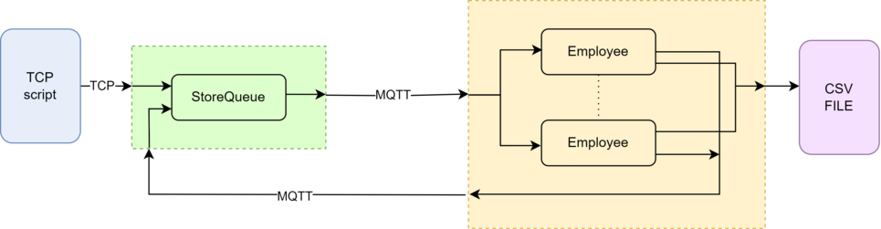

# StoreCashier scenario

## Description 

The following picture shows the diagram of the DEVS scenario under study. 
This use case scenario models the operation of a store cashier.
In this system, clients (modeled by a TCP script) join the line at a store's queue (modeled as StoreQueue).
The queue operates on a FIFO principle, matching each client with an available employee, analogous to customers waiting in line to check out their purchases.
Each employee (modeled as Employee) signals their availability by indicating whether they are free or occupied following an interaction with a client, thereby emulating the process of checking out purchases. 
The communication is carried out using the TCP and MQTT protocols as it can be seen in the picture.

## Source code

The scenario mix DEVS and non DEVS modeled system.
The DEVS systems are the queue and the employee and its implementation can be found at:

- System queue : [queueSys.py](queueSys.py)
- Systema employees : [employeeSys.py](employeesSys.py)

On the other hand, the TCP script that models the clients behaviour is at:

- Clients script: [Client_TCP_script.py](Client_TCP_script.py)

By default the CSV file will be store in this same directory. However if you want to change that, you must add the corresping path at line 73 in the [employees system](employeesSys.py) 

## Execution

### Communications config

Firstly is it important to guarantee the right configuration for the TCP and MQTT communications.

- For establishing the TCP communication you must select the desired host and port in the [TCP script](Client_TCP_script.py) and in the TCP_input_manager of the [queue](queueSys.py).
- For establish the MQTT communication you can follow the default structure or design one changing the MQTT_IO_handlers of both the [queue](queueSys.py) and the [employees](employeesSys.py).

In order to execute the system presented before you must be aware of the following:

- The scripts stated before must be executed independently as they intend to represent an independent system.
- For each source code, choose a time for simulation (sim_time) that will allow you to see how the overall system work. A small time can lead to a bad representation of the system.
- When running the scripts, the order does not matter. However is recomended to run first the [queue](queueSys.py), then the [employees](employeesSys.py) and finally the [clients](Client_TCP_script.py).

